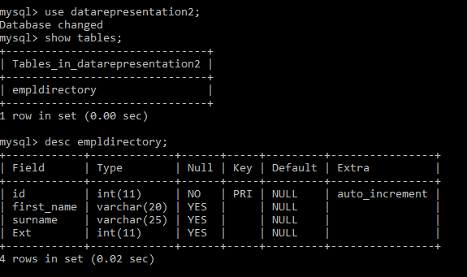
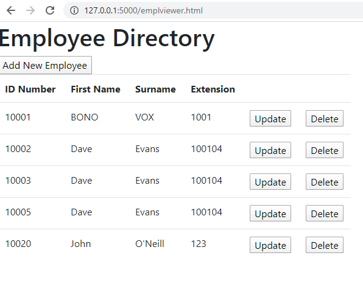
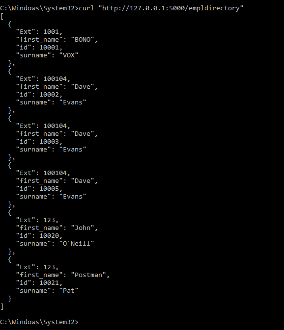
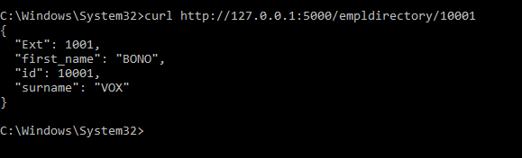
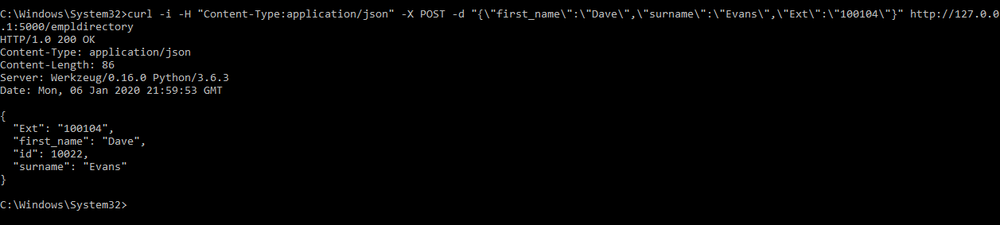
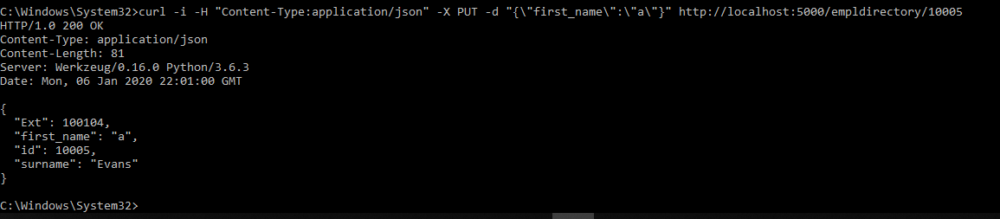
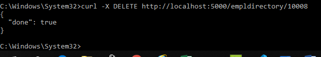
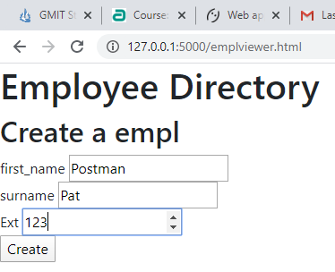
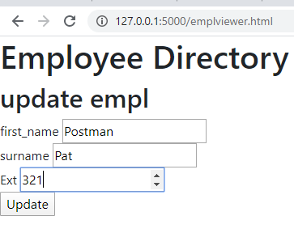

# DRProjectPA


Project Data:


## Final “clean” Git hub repository
https://github.com/JohnONeillGMIT/DRProjectPA.git

### Contains Files: 
+ Main file:  Server2.py
+ Flask: DAO.py
+ Configuration File: dbconfig.py
+ HTML File: Emplviewer.html
(also includes application.py… work on Pythonanywhere)

I did most of the work offline … some work was committed here as a “roughwork”
https://github.com/JohnONeillGMIT/DRProject.git

https://github.com/JohnONeillGMIT/dataRepresentation.git

PythonAnywhwere: Not up and running… http://johnoneillgmit.pythonanywhere.com/

+ SQL Database: datarepresentation2 
+ Table: empldirectory


## Code to create SQL Table:
In My SQL:

```
mysql> CREATE DATABASE datarepresentation2;
mysql> mysql> CREATE TABLE empldirectory (
    ->     id int(11)NOT NULL AUTO_INCREMENT,
    ->     first_name varchar(20),
    ->     surname varchar(25),
    ->     Ext int(11),
    -> PRIMARY KEY (id)
    -> );
```
    

### Schema here


Just in case it fails for some reason!!... I had it all working locally… updating HTML and in SQL concurrently with no issues in any of the CRUD.



### Curl Operations… to demonstrate CRUD operations from Server2.py

#### Get All :   curl http://127.0.0.1:5000/empldirectory



#### FindByID:   curl http://127.0.0.1:5000/empldirectory/10001



#### Create:	curl -i -H "Content-Type:application/json" -X POST -d "{\"first_name\":\"Dave\",\"surname\":\"Evans\",\"Ext\":\"100104\"}" http://127.0.0.1:5000/empldirectory



#### Update: #curl -i -H "Content-Type:application/json" -X PUT -d "{\"first_name\":\"a\"}" http://localhost:5000/empldirectory/10005



#### Delete: curl -X DELETE http://localhost:5000/empldirectory/10008




### CRUD in HTML…. 

#### Create: 





#### Update



